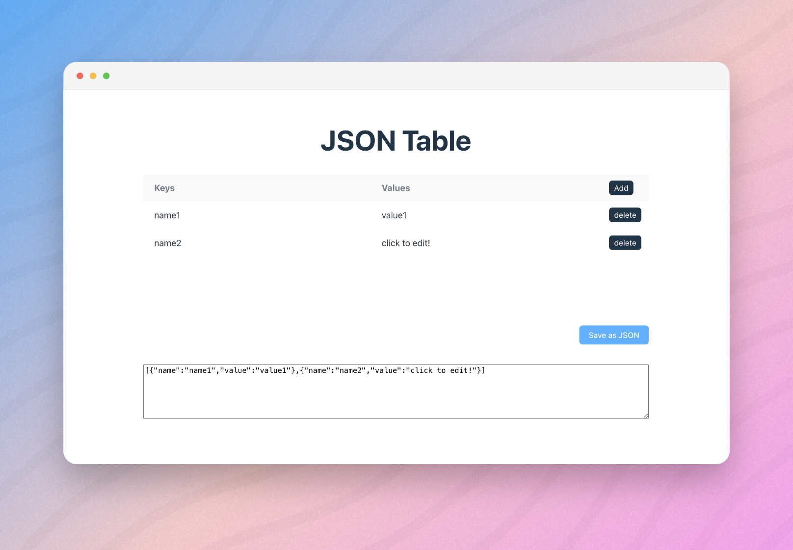

# [JSON Table Editor][web-url]

[JSON Table Editor][web-url] is a simple tool to view and edit JSON content in table format.
Built with [React], [Sass] and [TypeScript].

[web-url]: https://a-sokolova-dev.github.io/json-table/
[React]: https://react.dev/
[Sass]: https://sass-lang.com/
[TypeScript]: https://www.typescriptlang.org/

## 🚀 Preview



> Preview generated with [pika.style](https://pika.style/).

## 🛠️ Technologies

- [react](https://react.dev/)
- [sass](https://sass-lang.com/)
- [typescript](https://www.typescriptlang.org/)
- [react-beautiful-dnd](https://github.com/atlassian/react-beautiful-dnd)
- [vite](https://vitejs.dev/)

## ✨ Getting Started

### Clone the project using one of these ways:

1. [Fork](https://github.com/a-falkonia/json-table/fork) the repository

2. Clone the repository locally

```bash
git clone https://github.com/a-falkonia/json-table/
cd json-table
```

### Install dependencies

```bash
npm install
```

### Run the project

```bash
npm run dev
```

Open [http://localhost:5173/](http://localhost:5173/) with your browser to see the result.
